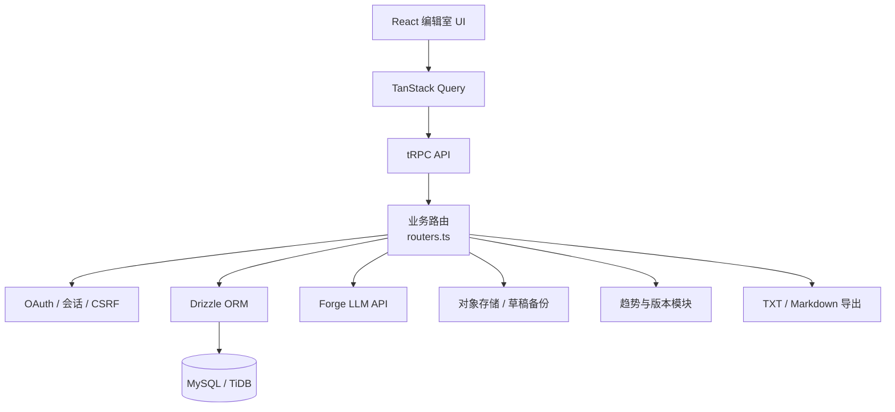

# Novel Forge


> 一个面向长篇小说的 AI 辅助数字编辑室：**让故事先成形，再成为作品**。

Novel Forge 把长篇创作拆成可持续维护的项目档案、世界观、人物、章节大纲和正文编辑流程。AI 负责提出草案、润色和续写建议，作者保留审核、修改和最终保存的决定权。

## 适合什么场景

Novel Forge 适合需要长期维护世界观、人物关系和章节版本的小说创作者。它不是一次性文本生成器，也不把 AI 输出直接视为最终稿；每次生成结果都会回到可编辑区域，由作者确认后再保存或建立版本档案。

## 功能总览

| 模块 | 能力 | 结果 |
|---|---|---|
| 作品档案 | 书名、题材、简介、目标字数和项目状态 | 管理多个小说项目 |
| 编辑室 | 世界、人物、大纲、章节正文集中编辑 | 从设定推进到章节 |
| AI 辅助 | 简介优化、设定生成、剧情灵感、润色和手动续写 | 生成可审核的候选内容 |
| 版本档案 | 保存大纲和正文历史，查看差异并回滚到编辑器 | 保护创作过程 |
| 趋势观察 | 查看番茄、抖音和 B 站的题材趋势样本 | 为选题提供参考 |
| 导出 | 导出 TXT 或 Markdown | 迁移或备份完整作品 |
| 可靠性 | 自动保存、离线恢复、服务端草稿备份、资源归属校验 | 降低丢稿和越权风险 |

## 产品架构



系统把前端编辑状态、服务端资源归属、数据库持久化和 AI 调用分开。AI 只负责候选内容，数据库和版本档案负责可追溯保存，路由层负责认证、输入校验和项目归属检查。

## 创作流程


其中“手动续写”是有意设计的安全边界：项目不会在后台自动生成下一章，避免未经确认的内容覆盖创作状态或消耗生成配额。

## 技术栈

| 层级 | 技术 |
|---|---|
| 前端 | React 19、Vite、Tailwind CSS 4、shadcn/ui、TanStack Query |
| 服务端 | Express 4、tRPC 11、TypeScript |
| 数据层 | Drizzle ORM、MySQL/TiDB |
| AI | Forge LLM API |
| 身份认证 | Manus OAuth |
| 测试 | Vitest、TypeScript 类型检查 |

## 目录结构

```text
client/src/pages/Home.tsx       # 主工作台与页面级导航
client/src/components/           # 编辑、趋势、版本和通用组件
client/src/lib/navigation.ts     # hash 导航与项目深链接
client/src/index.css             # 编辑室视觉系统
server/routers.ts                # tRPC 业务路由和 AI 入口
server/db.ts                     # 数据库访问辅助函数
server/scheduleLifecycle.ts      # 计划任务创建与补偿清理
server/_core/                    # OAuth、Vite、LLM、存储等基础设施
shared/                          # 共享题材、趋势和业务校验
drizzle/                         # 数据模型与迁移
```

## 本地运行

环境要求：Node.js 22+、pnpm 9+，以及可连接的 MySQL 或 TiDB 数据库。

```bash
git clone https://github.com/jingxinchen203-star/novel-forge.git
cd novel-forge
pnpm install
pnpm dev
```

生产构建与启动：

```bash
pnpm check
pnpm test
pnpm build
pnpm start
```

## 配置说明

请在本地创建 `.env`，并确保它已被 `.gitignore` 忽略。变量名称可能由部署模板或平台注入，常见基础配置如下：

| 变量 | 用途 | 注意事项 |
|---|---|---|
| `DATABASE_URL` | MySQL/TiDB 连接串 | 不要提交真实密码；生产环境使用 Secret。 |
| `JWT_SECRET` | 会话或签名密钥 | 使用随机长字符串，不要复用示例值。 |
| `VITE_APP_TITLE` | 前端标题 | 只放公开展示文本。 |
| Forge / LLM 配置 | AI 生成、润色和续写 | 按部署平台提供的服务配置注入。 |
| OAuth 配置 | 登录和回调 | 回调地址必须与部署域名一致。 |
| 对象存储配置 | 草稿备份和文件上传 | 限制 bucket 权限和跨域来源。 |

配置原则是：**README 只描述变量用途，不写真实密钥；测试使用 mock；生产使用平台 Secret；本地开发使用单独数据库**。

## 测试与质量检查

```bash
pnpm check
pnpm test
pnpm build
```

重点测试范围包括资源归属、认证退出、草稿清理、AI 生成配额、手动续写、版本保存、趋势筛选、Origin/CSRF 防护、调度补偿和前端导航。涉及真实登录、外部 AI、对象存储或多实例部署的行为，还应在 staging 环境中验收。

## 安全与数据边界

所有项目、章节、版本和趋势维护操作都应绑定当前用户并经过输入校验。外部趋势数据只是观察样本，不代表平台官方排名、医疗结论或投资建议。AI 输出必须经过作者审核，不能替代编辑判断。

不要把数据库密码、OAuth Secret、LLM API Key、用户草稿或真实导出文件提交到 Git。对外部署时应同时配置 HTTPS、可信 Origin、最小化数据库账号权限和受限对象存储策略。

## 当前状态

项目已经包含核心创作链路、页面式信息架构、手动续写、分区 AI 生成、趋势表格、版本管理、基础安全加固和编辑室视觉系统。提交改动后，请以本地 `pnpm check`、`pnpm test` 和 `pnpm build` 的实际结果作为发布依据。

## 许可证

本项目使用 [MIT License](LICENSE)。
